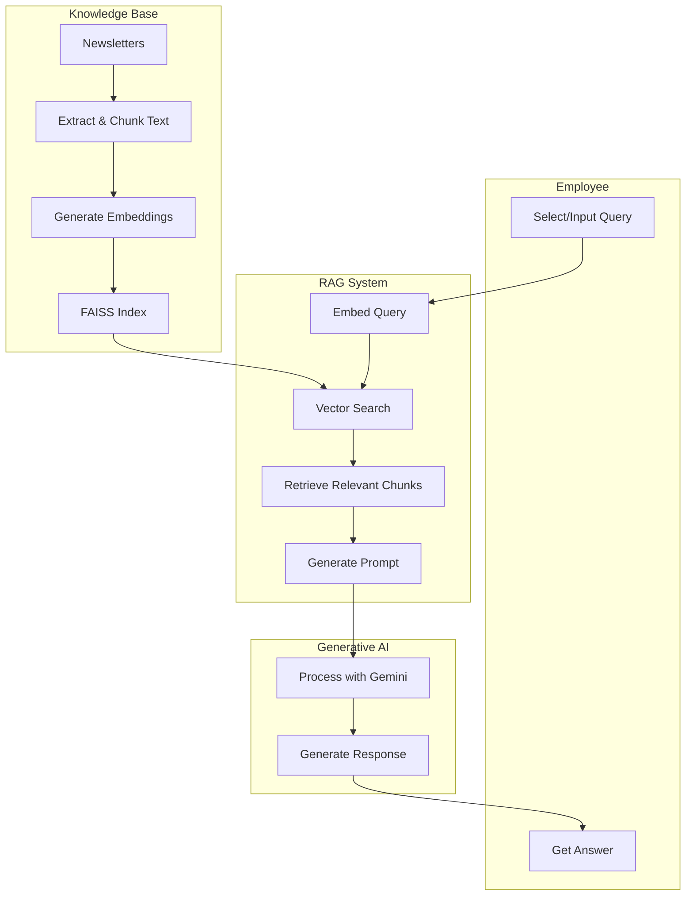
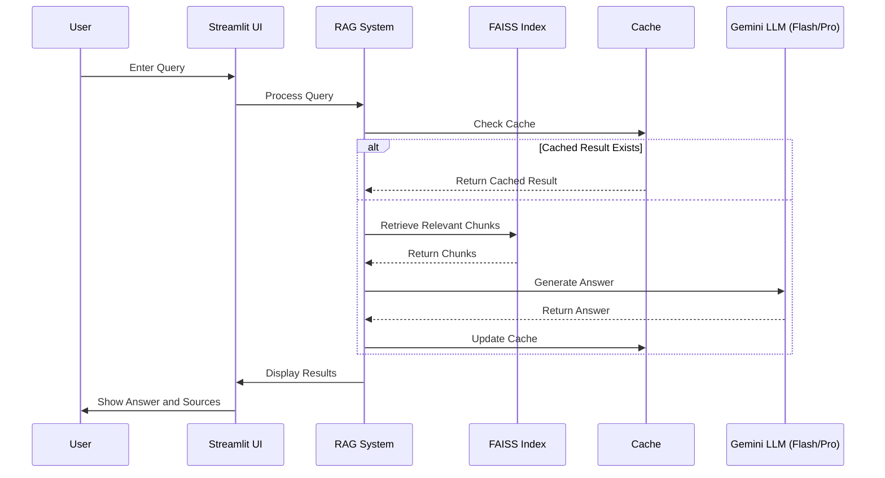
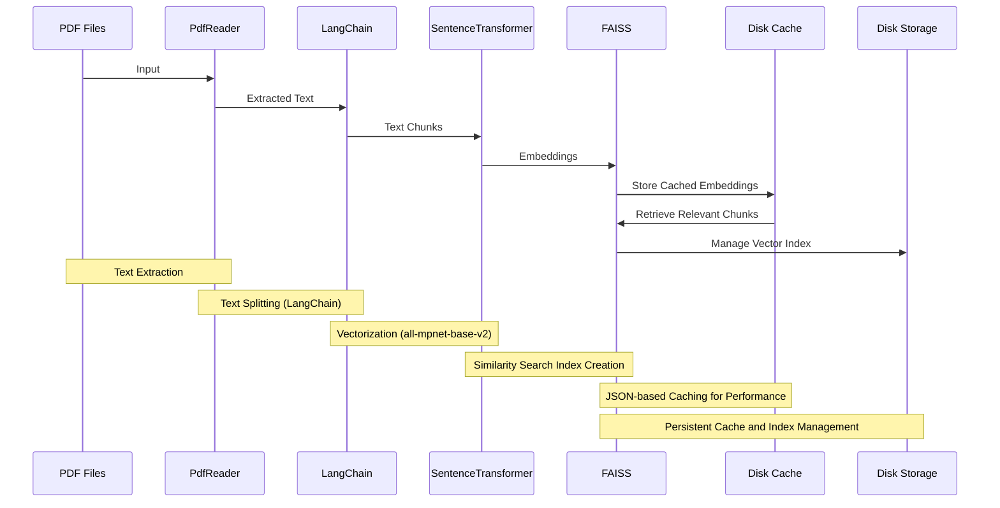
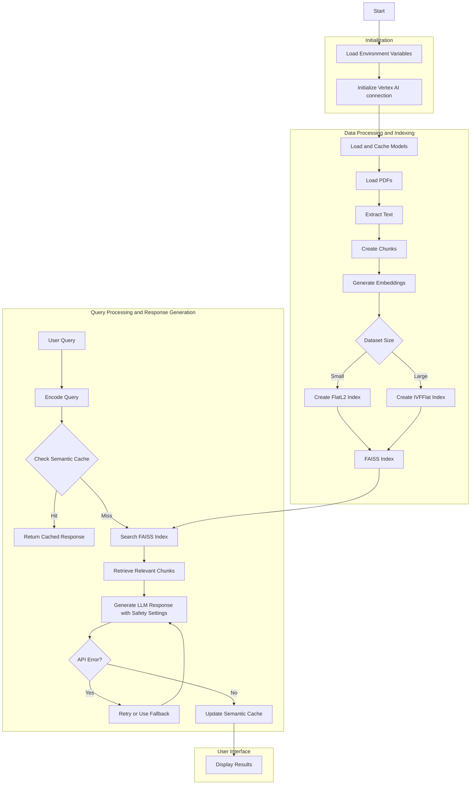

# Newsletter.AI - Chat with your company's newsletters using Gen AI

Employees in our company struggle with information overload from the numerous weekly newsletters generated by various departments.

It is difficult for employees to read all of them, or to easily search through past newsletters.

It would be great to have a solution that allows employees to "chat" with the past and present newsletters from different departments.

## Generative AI for NewsLetters

Using Generative Artificial Intelligence, Newsletter.AI processes newsletter content, allowing you to ask questions and receive relevant answers.

The tool uses vector databases and retrieval-augmented generation (RAG) to find the most pertinent pieces of information, even if you do not use exact keywords.

Simply type your question, and Newsletter.AI compiles an accurate response by retrieving information from the newsletters.

## How NewsLetter.AI Works?

Here is a simple overview of the diagram above:

1. User Interaction
   1. You start by either selecting a pre-defined question or typing your own query.
   2. After entering your question, you click a button to get an answer.
2. Behind the Scenes - Knowledge Base
   1. The system is fed with Newsletters regularly. The documents can be in any format e.g. docx, pdf, txt, etc.
   2. These documents are processed and the text is extracted and broken into smaller, manageable pieces.
   3. Each piece of text is then converted into a special format that computers can easily work with.
   4. All this processed information is organized in a way that makes it quick to search through.
3. Finding Relevant Information
   1. When you ask a question, the system converts it into the same special format used for the document pieces.
   2. It then quickly searches through all the processed document pieces to find the ones most relevant to your question.
4. Generating an Answer
   1. The system takes your question and the relevant pieces of information it found.
   2. It combines these into a carefully worded request for an AI language model (in this case, Google's Gemini).
   3. The AI model processes this request and generates a response.
5. Presenting the Answer
   1. Finally, the system takes the AI-generated response and presents it back to you as an answer to your question.

This workflow allows the system to quickly find relevant information from a large collection of documents and use an AI to formulate a response tailored to your specific question.

## Key Components of NewsLetter.AI

- **Large Language Model (LLM) to Generate Context-Aware Responses**
  - NewsLetter.AI uses Google Gemini models via Vertex AI to generate natural language responses.
  - Users can select between two Gemini models: [Gemini 1.5 Flash](https://console.cloud.google.com/vertex-ai/publishers/google/model-garden/gemini-1.5-flash-001) and [Gemini 1.5 Pro](https://console.cloud.google.com/vertex-ai/publishers/google/model-garden/gemini-1.5-pro-001).
  - Responses are generated through the Gemini API, with detailed usage documented [here](https://cloud.google.com/vertex-ai/generative-ai/docs/model-reference/inference).
  - The [Vertex AI Python library](https://cloud.google.com/python/docs/reference/aiplatform/latest) is used to interact with the API.
  - Installing Vertex AI client libraries is necessary, as documented [here](https://cloud.google.com/vertex-ai/docs/start/client-libraries).
- **Google Cloud Build for Building Docker Images**
  - Google Cloud Build automates creating Docker images for NewsLetter.AI from source code.
  - The build process involves fetching the application, executing steps to compile and package, and generating the Docker image.
  - This ensures a consistent build process, supporting continuous integration and deployment.
- The entire build process is managed code-as-infrastructure as documented [here](https://cloud.google.com/build/docs/configuring-builds/create-basic-configuration).
- **Google Cloud Run to Host the Streamlit App**
  - NewsLetter.AI is deployed and hosted on Google Cloud Run as a serverless container.
  - It scales automatically based on request volume, optimizing resource costs.
- **Sentence Transformers for Text Chunk and Query Embeddings**
  - The `SentenceTransformer` model [all-mpnet-base-v2](https://huggingface.co/sentence-transformers/all-mpnet-base-v2) generates dense vector embeddings from PDF text data.
  - These embeddings enable semantic search to find text chunks relevant to user queries.
- **FAISS (Facebook AI Similarity Search) for Efficient Similarity Search**
  - FAISS performs fast nearest neighbor searches among embeddings.
  - Different FAISS index types (`IndexFlatL2` or `IndexIVFFlat`) are dynamically chosen based on dataset size to optimize speed and accuracy.
- **PyPDF for PDF Text Extraction**
  - `PdfReader` from [pypdf](https://pypdf.readthedocs.io/en/latest/index.html) extracts text from PDF files for analysis.
  - This allows processing document-based data sources.
- **Langchain for Text Chunking and Splitting**
  - `RecursiveCharacterTextSplitter` from [Langchain](https://python.langchain.com/v0.1/docs/modules/data_connection/document_transformers/recursive_text_splitter/) breaks text into smaller chunks.
  - This ensures text chunks are manageable for embedding and retrieval.
- **Caching Mechanism to Enhance Query Response Times**
  - A JSON-based cache stores previous queries, embeddings, and responses.
  - The system checks the cache for similar queries to reuse previous results, reducing redundancy and improving performance.
- **Streamlit for User Interface Development**
  - Streamlit creates a web app interface for users to input queries and view responses.

## Input Documents for NewsLetter.AI

To showcase how NewsLetter.AI works with Generative AI on custom documents, I created fictional NewsLetters for 4 departments viz. Sales, Networks, COPS & IT.

The chatbot answers questions based on these newsletters.

So for example, if an employee wants to know what are "current month's customer satisfaction scores", then they can just ask the chatbot that question and get the answer using the power of Generative AI.

As fresh newsletters get published or old newsletters get corrected, you just need to place them in the [input_files folder](./input_files). No code changes needed to the chatbot. The chatbot starts providing answers based on latest information.
This is on account of the **intelligent hash-based cache management** implemented in NewsLetter.AI. You can find more details - [here](./readme.md#uniqueness-of-rag-logic-in-newsletterai)

## What sets NewsLetter.AI apart?

- **Choice of Language Models**
  - The frontend allows users to choose between different models, empowering them to match their needs:
    - Current options include Google's Gemini 1.5 models (both Flash and Pro versions).
    - Users can select based on preferences like speed versus quality, enhancing flexibility.
- **Source Attribution**
  - Responses from NewsLetter.AI are accompanied by sources and specific document chunks used:
    - Provides users insight into the origins of the response, enhancing transparency and trust.
    - Utilizes the `chunk_to_doc` mapping for clear traceability.
- **Adaptive FAISS Indexing**
  - The system selects the most suitable FAISS index based on dataset size:
    - Utilizes a `FlatL2` index for precise results on smaller collections.
    - Switches to an `IVFFlat` index with optimized clustering for efficient search in larger datasets.
    - This adaptability ensures optimal performance with low latency, regardless of dataset size.
- **Multi-Level Caching Strategy**
  - NewsLetter.AI employs a multi-tiered caching approach to optimize performance:
    - Streamlit's `@st.cache_data` decorator caches processed PDF content for efficiency.
    - Vector embeddings are cached using `@st.cache_resource` to enhance retrieval speed and avoid recomputation.
    - A custom semantic cache stores and retrieves responses for similar queries, thus accelerating repeated tasks.
- **Hash-Based Dynamic Cache Invalidation**
  - NewsLetter.AI implements a sophisticated, hash-based cache invalidation mechanism:
    - A hash of all input files is computed on each run.
    - When the hash changes, indicating updated content, all relevant caches are automatically invalidated and rebuilt.
    - This approach ensures the system always works with the most current information, minimizing downtime and resource usage.
- **Error Handling and Retry Mechanism**
  - The system uses a retry mechanism with exponential backoff for API calls:
    - This ensures resilience against temporary failures or network issues.
    - The gradual recovery approach maintains stability and reliability in production environments.
- **Continuous Integration and Deployment (CI/CD):**
  - Google Cloud Build supports a robust CI/CD pipeline, allowing for automated testing and deployment of new features.
  - Google Container Registry (GCR) is used for image storage, simplifying version management and deployment workflows.
  - This enables rapid iteration and delivery of updates, ensuring that the application stays current and aligned with user needs.
- **Scaling on-demand**
  - NewsLetter.AI is deployed on Google Cloud Run.
  - This leads to a fully managed environment that can scale on-demand.
- **Direct Integration with Vertex AI**
  - Service Accounts allow direct integration of the Streamlit application in Cloud Run to Vertex AI resources.
  - This direct integration enables the use of any model from from the Model Garden.

## Architecture of NewsLetter.AI

This section explains the architecture of NewsLetter.AI through various diagrams.

### User Journey

This diagram demonstrates how the end-user flow looks like

See below a brief description of the diagram above:

1. **Initialization**: The application processes PDF files and creates a FAISS index for efficient similarity search. Caching is employed to boost performance and ensure the application uses the most up-to-date data.
2. **User Interaction**: The user interacts with the Streamlit UI, selecting a predefined question or entering their own query.
3. **Query Processing**:
   1. The application checks for any changes in the input PDF files to update processed data.
   2. Relevant text chunks are retrieved from the FAISS index.
   3. The chosen Gemini model (Flash or Pro) utilizes the retrieved chunks to generate a response.
   4. The answer, along with source documents, is displayed to the user. Caching is employed for repeated queries to improve performance.

The application utilizes caching mechanisms to improve performance for repeated queries.

### Hash based caching

NewsLetter.AI excels at giving excellent answers, while still being fast and less resource hungry due to the hash based cache management implemented in its code.
Below diagram shows throws some light on this caching aspect. The diagram is followed by a detailed explanation.

This diagram illustrates the flow of the RAG (Retrieval-Augmented Generation) system implemented in the code:

1. **Text Extraction**: PDF files are processed using PyPDF (specifically PdfReader) to extract raw text.
2. **Semantic Segmentation**: The extracted text is split into meaningful chunks using LangChain's RecursiveCharacterTextSplitter.
3. **Vectorization**: SentenceTransformer (using the 'all-mpnet-base-v2' model) converts text chunks into numerical embeddings.
4. **Similarity Search Index Creation**: FAISS organizes these embeddings for efficient retrieval. The code dynamically selects between FlatL2 and IVFFlat index types based on the number of chunks.
5. **Caching for Performance**: The system implements a semantic caching mechanism with a JSON-based disk cache to store and retrieve similar queries and responses, enhancing response times.
6. **Persistent Storage**: The FAISS index and cache are managed to ensure data persistence and quick access across user sessions.

When a query is received, the system:

1. Checks the semantic cache for similar previous queries.
2. If not found in the cache, it uses the FAISS index to retrieve relevant text chunks.
3. These chunks are then used to augment the prompt sent to the Gemini model (either 1.5 Flash or 1.5 Pro) for generating the final response.

### Full Architecture

Here is a high-level overview of the NewsLetter.AI system:

## Deploy on Google Cloud

- The deployment of NewsLetter.AI on google cloud is **fully automated** and CI-CD compliant.
- All that you need to do is update the values in the [cloudbuild.yaml](cloudbuild.yaml) with relevant
  - project name
  - region name
- Also create or reuse a **service account** that has the below privileges for accessing the project where NewsLetter.AI is hosted:
  - Cloud Run Admin
  - Editor
  - Vertex AI Administrator
  - Storage Admin
- Additionally, you would have to create a [Cloud Build Trigger](https://cloud.google.com/build/docs/automating-builds/create-manage-triggers) with below attributes
  - Event - `Push`
  - Configuration - `Autodetected`
  - Location - `Repository` (add access to the github repo)
  - Select the [GitHub repository](https://github.com/kanad13/NewsLetter-AI) and configure the trigger to activate on push events.
  - Service account - Select the one created above
  - Click `Create trigger`.
  - Make sure to specify the branch (e.g., `main` or `master`) you want to trigger the build on.

## Acknowledgements

NewsLetter.AI is powered by a combination of open and closed-source technologies. I am grateful for the contributions of the following initiatives and organizations:

- [Python](https://github.com/python) - The backbone of NewsLetter.AI's codebase.
- [PyPDF](https://pypdf.readthedocs.io/en/latest/index.html) - It is used for text extraction and processing from PDF documents.
- [Hugging Face](https://huggingface.co/sentence-transformers/all-mpnet-base-v2) - The `all-mpnet-base-v2` SentenceTransformer model is used to generate embeddings for semantic search.
- [Facebook](https://faiss.ai) - Facebook AI Similarity Search (FAISS) is used for performing similarity searches.
- [Langchain](https://python.langchain.com/v0.1/docs/modules/data_connection/document_transformers/recursive_text_splitter/) - This RecursiveCharacterTextSplitter is used for breaking down large text into manageable chunks, optimizing them for embedding and retrieval.
- [Google Cloud](https://cloud.google.com/) is used for deploying & hosting NewsLetter.AI. The Generative AI capabilities in NewsLetter.AI are enabled by Vertex AI.
- [Streamlit](https://streamlit.io/) - Streamlit provides the technology to build the frontend for the NewsLetter.AI chatbot.
- **The Broader AI/ML Community** - A special thanks to the AI/ML community whose ongoing research and open-source contributions have laid the foundation for this project.
